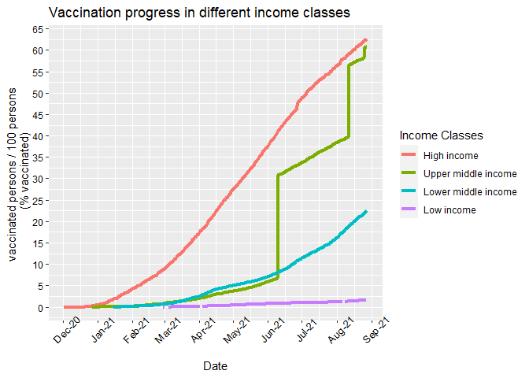

Untitled
================

Load Libraries

``` r
library(plyr)
library(tidyverse)
```

    ## -- Attaching packages --------------------------------------- tidyverse 1.3.1 --

    ## v ggplot2 3.3.5     v purrr   0.3.4
    ## v tibble  3.1.4     v dplyr   1.0.7
    ## v tidyr   1.1.3     v stringr 1.4.0
    ## v readr   2.0.1     v forcats 0.5.1

    ## -- Conflicts ------------------------------------------ tidyverse_conflicts() --
    ## x dplyr::arrange()   masks plyr::arrange()
    ## x purrr::compact()   masks plyr::compact()
    ## x dplyr::count()     masks plyr::count()
    ## x dplyr::failwith()  masks plyr::failwith()
    ## x dplyr::filter()    masks stats::filter()
    ## x dplyr::id()        masks plyr::id()
    ## x dplyr::lag()       masks stats::lag()
    ## x dplyr::mutate()    masks plyr::mutate()
    ## x dplyr::rename()    masks plyr::rename()
    ## x dplyr::summarise() masks plyr::summarise()
    ## x dplyr::summarize() masks plyr::summarize()

``` r
library(lubridate)
```

    ## 
    ## Attache Paket: 'lubridate'

    ## Die folgenden Objekte sind maskiert von 'package:base':
    ## 
    ##     date, intersect, setdiff, union

``` r
library(here)
```

    ## here() starts at B:/Dateien/Download/RProj/21_09_20_CoVaccHomework

    ## 
    ## Attache Paket: 'here'

    ## Das folgende Objekt ist maskiert 'package:plyr':
    ## 
    ##     here

``` r
library(usethis)
```

Setting date format to English so that no one is bothered by German
month names

``` r
Sys.setlocale("LC_TIME", "C")
```

    ## [1] "C"

Importing data

``` r
vacc<-read.csv("vaccinations.csv")
##vacc
##head(vacc)
##dates<-vacc$date
```

Extracting four different income classes from data and combining them

``` r
low = filter(vacc,str_detect(iso_code,"OWID_LIC"))
lowmid = filter(vacc,str_detect(iso_code,"OWID_LMC"))
upmid = filter(vacc, str_detect(iso_code,"OWID_UMC"))
high = filter(vacc, str_detect(iso_code, "OWID_HIC"))
inc_classes=rbind(low,lowmid,upmid, high)
##inc_classes
```

Changing “date” from <chr> to <date> and appending it to the dataframe
So that graph later recognises “date” as continous and not discrete

``` r
str(inc_classes$date)
```

    ##  chr [1:950] "2021-02-15" "2021-02-16" "2021-02-17" "2021-02-18" ...

``` r
##inc_classes$date
dates_form=ymd(inc_classes$date)
str(dates_form)
```

    ##  Date[1:950], format: "2021-02-15" "2021-02-16" "2021-02-17" "2021-02-18" "2021-02-19" ...

``` r
inc_classes <- inc_classes %>%
  add_column(DateForm =dates_form)
##inc_classes
```

Reordering legend labels by introducing new factored column in dataframe

``` r
inc_classes$inc_fac <- factor(inc_classes$location, levels=c("High income", "Upper middle income", "Lower middle income", "Low income"), 
                    labels=c("High income", "Upper middle income", "Lower middle income", "Low income"))
```

Plotting graph

``` r
g=ggplot(data=inc_classes)+
  geom_line(mapping=aes(x=dates_form,y=people_vaccinated_per_hundred,group=inc_fac,color=inc_fac),size=1.5)+
  
  ## TITLE and LEGEND manipulation
  labs(title="Vaccination progress in different income classes")+
  scale_colour_discrete("Income Classes",)+

  ## X-AXIS manipulation
  theme(axis.text.x = element_text(color="black", size=10, angle=45),axis.text.y = element_text(color="black",size=9, angle=0))+
  scale_x_date(date_breaks = "months" , date_labels = "%b-%y")+
  xlab("Date")+

  ## Y-AXIS manipulation
  scale_y_continuous(name="vaccinated persons / 100 persons \n (% vaccinated)",breaks = scales::pretty_breaks(n = 10))
print(g)
```

<!-- -->
